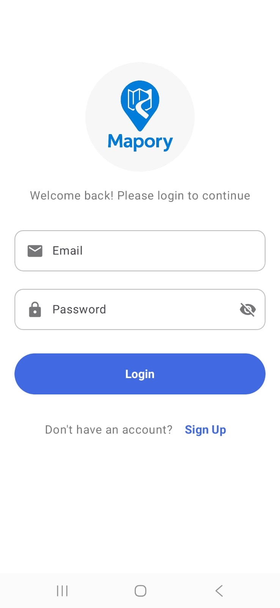
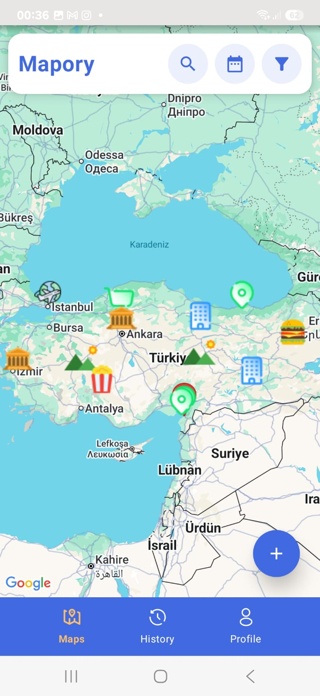
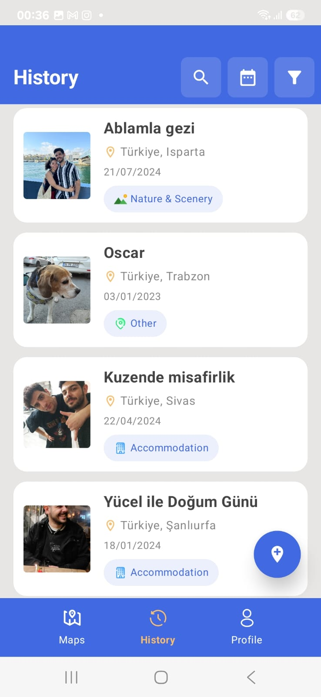
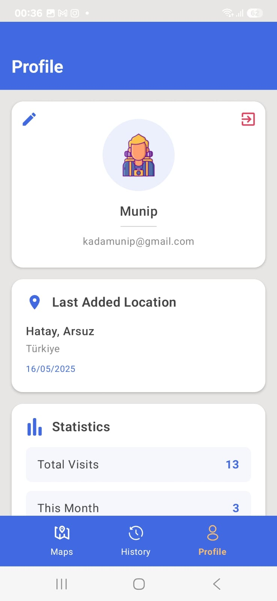
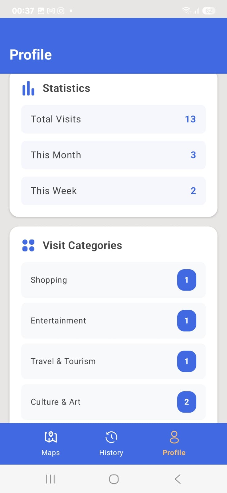
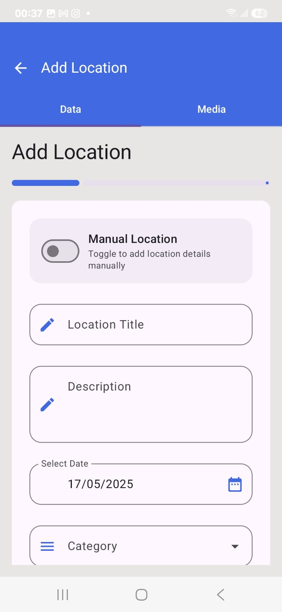
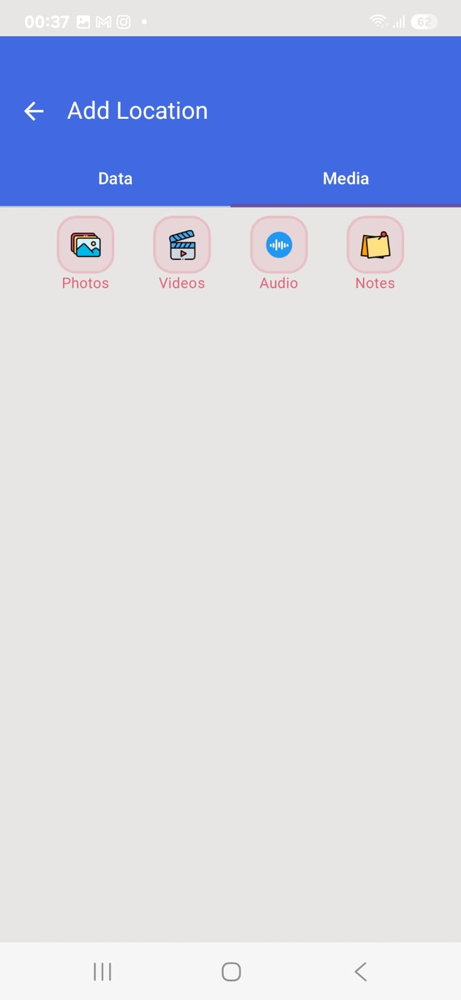
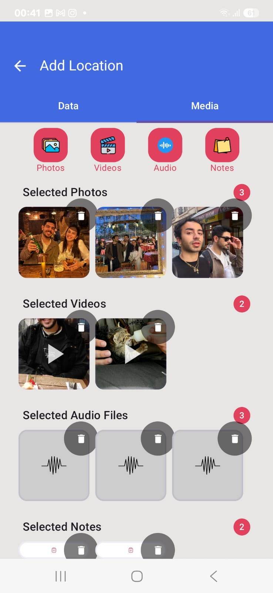

# 📍 Mapory – Location Diary App

**Mapory** is a mobile diary application that helps users save the places they've visited as memories enriched with photos, videos, audio recordings, and notes. These memories are displayed on an interactive map, making them easily accessible and visually engaging.

---

## 🎯 Purpose

- Save memorable locations you’ve visited  
- Add rich media (photos, videos, audio, notes) to each location  
- View all your memories on an interactive map  

---

## 📱 Screenshots

### Login  

### Map  

### History  

### Profile  
<table>
  <tr>
    <td></td>
    <td></td>
  </tr>
</table>

### Add Memory  
<table>
  <tr>
    <td></td>
    <td></td>
    <td></td>
  </tr>
</table>

## 🚀 Features

- 📸 Add media: photo, video, audio, and notes  
- 🗺️ View all saved memories on the map  
- 🔎 Search memories by name  
- 🗂️ Filter by category and date  
- 👤 Profile statistics:  
  - Number of memories created this week, this month, and in total  
  - Count of visits per category  

---

## 🛠️ Technologies Used

- **Kotlin** for Android development  
- **Firebase** (Authentication & Firestore)  
- **Google Maps SDK**  
- Third-party libraries: Glide, ExoPlayer, etc.  

---

## 🔐 Login Flow

- First launch shows the Login screen  
- If the user doesn't have an account, they can register  
- After successful login, the app navigates to the map screen  
- Unless logged out, users are always taken directly to the map on launch  

---

## ➕ Add New Memory Flow

1. Select the current location or choose manually on the map  
2. Enter a memory title, description, and select a date (past or present)  
3. Add media files (photo, video, audio, notes) either live or from the device  
4. Save the memory, which will appear on the map and be stored in Firebase  

---

## 📦 Installation

### Requirements

- Android Studio (Giraffe or newer)  
- Kotlin 1.9+  
- Android SDK API Level 33+  
- Firebase project with `google-services.json` configured  

### Steps

1. git clone https://github.com/Munipp/Mapory.git  
2. Open the project in Android Studio  
3. Sync Gradle dependencies  
4. Add your google-services.json to the /app folder  
5. Run the app on an emulator or device  

